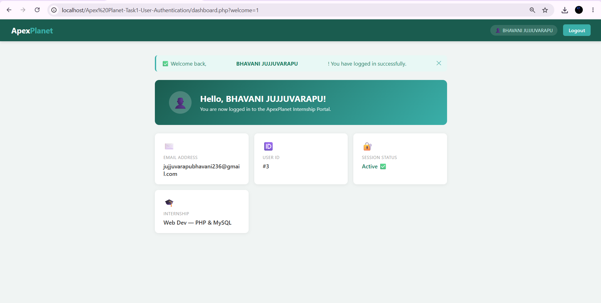
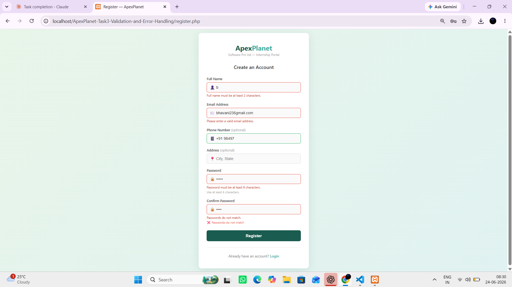
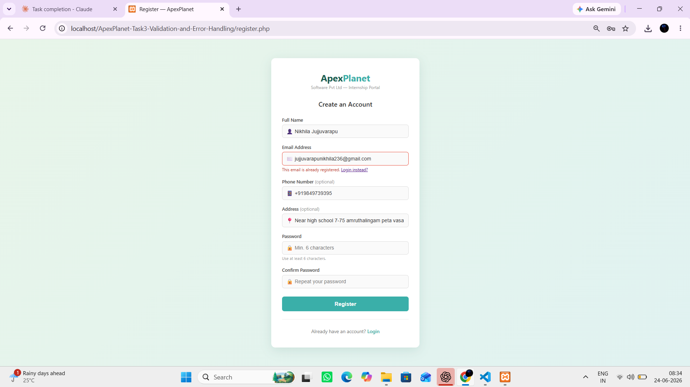
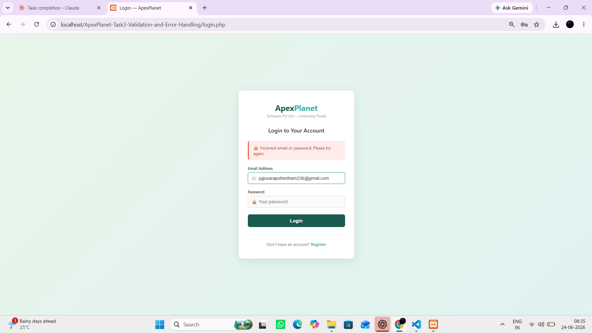
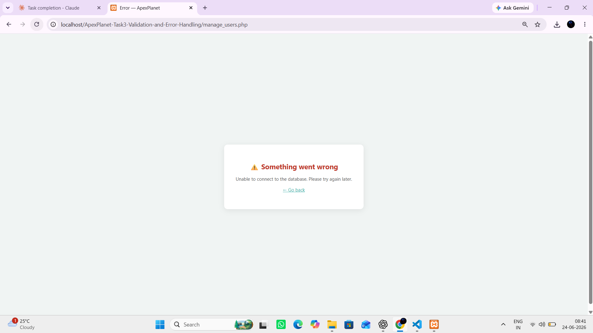
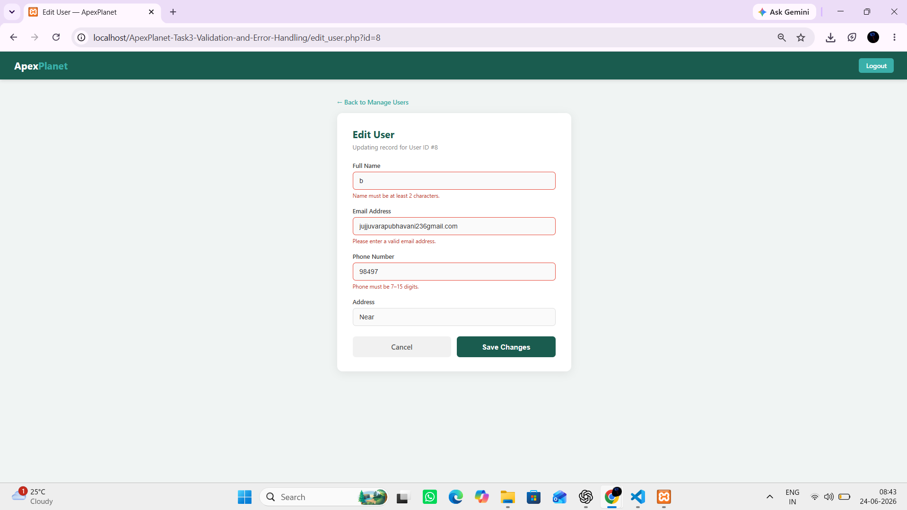

# ApexPlanet-Task3-Validation-Error-Handling

A PHP & MySQL web application with comprehensive **input validation and robust error handling** — built as part of the **ApexPlanet Software Pvt. Ltd. 30-Day Web Development Internship (Task 3)**. Builds directly on Tasks 1 and 2.

---

## 🛠 Tech Stack

- PHP (PDO — upgraded from MySQLi for exception-based error handling)
- MySQL
- HTML5 / CSS3 / JavaScript (client-side validation)
- XAMPP / WAMP

---

## 📁 Project Structure

```
task3/
├── db.php             # PDO connection with ERRMODE_EXCEPTION + renderDbError()
├── setup.sql          # SQL script (unchanged from Task 2)
├── register.php       # Create — server + client validation, try-catch
├── login.php          # Login — server + client validation, try-catch
├── dashboard.php      # Protected dashboard — session fixation guard, auto-fade alert
├── manage_users.php   # Read — PDO queries wrapped in try-catch, error flash
├── edit_user.php      # Update — server + client validation, try-catch
├── delete_user.php    # Delete — try-catch, error redirect on failure
├── logout.php         # Secure logout — clears $_SESSION, deletes cookie, destroys server session
└── README.md
```

---

## ⚙️ Setup Instructions

### 1. Install XAMPP / WAMP
Download and install [XAMPP](https://www.apachefriends.org/) or [WAMP](https://www.wampserver.com/) and start **Apache** and **MySQL** services.

### 2. Place the project
- **XAMPP:** `C:/xampp/htdocs/task3/`
- **WAMP:** `C:/wamp64/www/task3/`

### 3. Create the database
Run `setup.sql` in phpMyAdmin (same schema as Task 2). If already created, skip.

### 4. Configure credentials
Open `db.php` and update:
```php
define('DB_USER', 'root');
define('DB_PASS', '');
```

### 5. Run
```
http://localhost/task3/register.php
```

---

## 🚀 Key Improvements in Task 3

### 🔄 Switched from MySQLi → PDO
| | MySQLi (Task 1 & 2) | PDO (Task 3) |
|---|---|---|
| Error handling | Manual checks | Exceptions via `ERRMODE_EXCEPTION` |
| Prepared statements | `bind_param()` | Named placeholders (`:name`) |
| SQL injection | Protected | Protected |
| try-catch support | Limited | Full `PDOException` support |

### ✅ Client-Side Validation (JavaScript)
Applied on every form — validates **before** the request is even sent:

| Form | Rules validated client-side |
|---|---|
| Register | Name ≥ 2 chars, valid email format, phone format, password ≥ 6 chars, passwords match |
| Login | Valid email format, password not empty |
| Edit User | Name ≥ 2 chars, valid email format, phone format |

- Real-time password match feedback (✅ / ❌) as you type
- `blur` event validation on email and phone fields
- On submit: first invalid field is auto-focused
- Visual feedback: `is-invalid` (red border) / `is-valid` (green border) classes

### ✅ Server-Side Validation (PHP)
All inputs re-validated on the server regardless of client-side checks:

| Field | Rules |
|---|---|
| Name | Required, 2–100 chars, letters/spaces/hyphens/apostrophes only (`preg_match`) |
| Email | Required, `filter_var(FILTER_VALIDATE_EMAIL)`, max 150 chars |
| Phone | Optional — must match `^[0-9+\-\s]{7,15}$` if provided |
| Password | Min 6, max 72 chars (bcrypt limit) |
| Confirm | Must match password |

Inline field errors shown next to each input on POST, not just a general error block.

### ✅ SQL Injection Prevention
All queries use PDO **named prepared statements** — no raw user input ever interpolated into SQL:
```php
// ✅ Safe — user input goes through a bound parameter
$stmt = $pdo->prepare("SELECT id FROM users WHERE email = :email");
$stmt->execute([':email' => $email]);

// ❌ Unsafe — never done in this project
$result = $pdo->query("SELECT * FROM users WHERE email = '$email'");
```

### ✅ try-catch Error Handling
Every database operation is wrapped in a `try-catch (PDOException $e)` block:
```php
try {
    $stmt = $pdo->prepare("...");
    $stmt->execute([...]);
} catch (PDOException $e) {
    error_log("Context: " . $e->getMessage()); // real error logged server-side
    $errors['db'] = "Friendly message shown to user."; // safe message for user
}
```
- Real errors go to `error_log()` (visible in XAMPP's `apache_error.log`)
- Users always see a clean, friendly message — never a raw database error

---

## 📸 Screenshots

### Dashboard — Login Success Alert (auto-fades after 4s)


### Register — Client-Side Validation Errors


### Register — Server-Side Validation Errors


### Login — Validation Error


### Manage Users — DB Error Handling


### Edit User — Field-Level Errors


---

## 🔐 Security Highlights

- **No raw SQL** — 100% prepared statements with named placeholders
- **Passwords** hashed with `password_hash(PASSWORD_BCRYPT)`, verified with `password_verify()`
- **Secure logout** — three-step process: `$_SESSION = []` clears variables, `setcookie()` deletes the session cookie from the browser, `session_destroy()` removes the session from the server
- **Generic login error** — "Incorrect email or password" never reveals which field was wrong
- **XSS prevention** — all output through `htmlspecialchars()`, inputs sanitized with `ENT_QUOTES`
- **Real errors hidden** — raw PDOException messages only go to `error_log()`, never to the browser

---

## 👨‍💻 Author

**Name:** Nikhila Jujjuvarapu
**Internship at:** ApexPlanet Software Pvt. Ltd.
**Program:** Web Development — PHP & MySQL (30 Days)
**Task:** Task 3 — Validation and Error Handling
